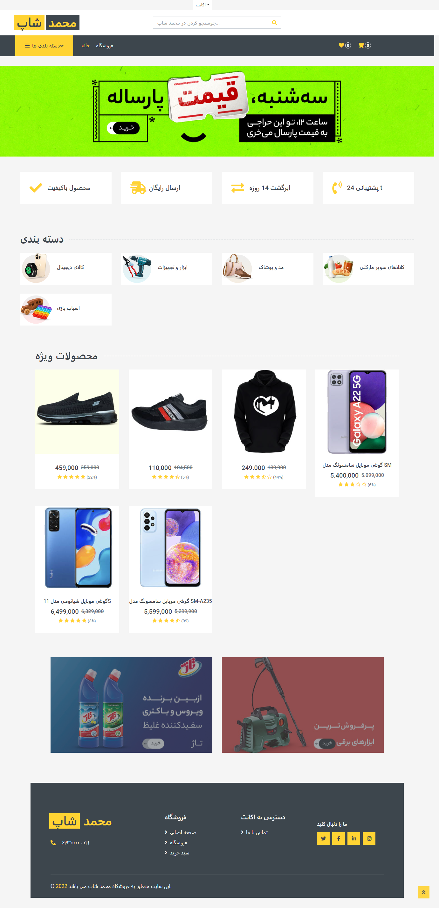

  

  <h3 align="center">  Mohammad Shop Website </h3>

  

    You can get more information from my personal website
     
     
    <a href="https://github.com/MohamadNematizadeh/laravel_mohammad_shop">View Demo</a>
  

    

## About The Project

front : Html , css  , botostart

back and : Php , Laravel , Sql 

It has been tried to clean the code
happy we with star and follow in linkedin , enjoy coding :)
